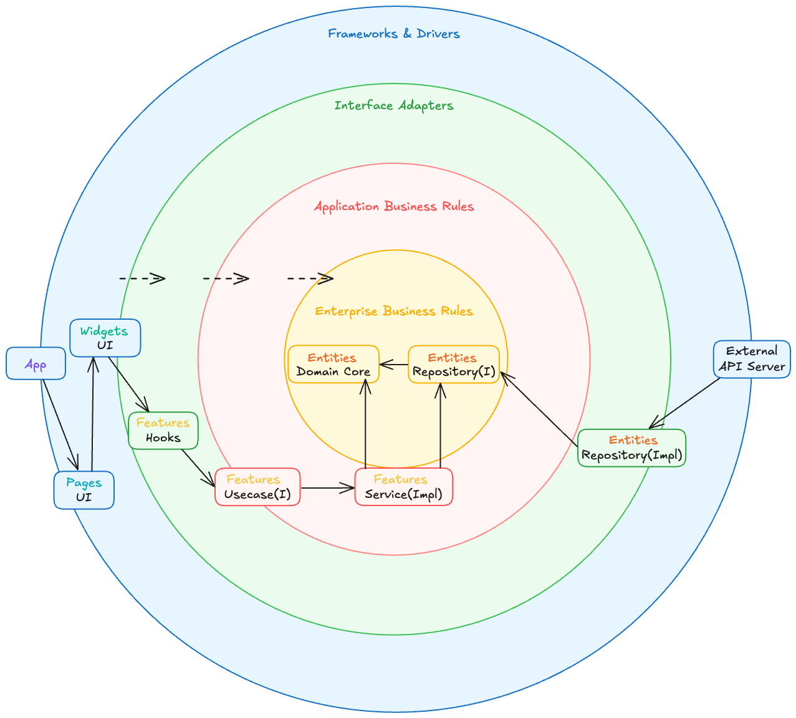

# Frontend Clean Architecture (with FSD & DDD)

An experimental frontend architecture example implementing Feature-Sliced Design, Domain-Driven Design, and Clean Architecture principles with Next.js.

> ⚠️ **Note**: This is an example project designed to demonstrate architectural patterns and principles. It intentionally includes over-engineering to showcase various design concepts clearly.

## Documentation

Detailed guides available in:

- 🇺🇸 [English](docs/README.en.md)
- 🇰🇷 [한국어](docs/README.ko.md)

📝 Blog Post: [Frontend Clean Architecture (with FSD & DDD)](https://lapidix.dev/posts/fsd-ddd-clean-architecture)

## What This Project Demonstrates

### Architecture Patterns

- **Feature-Sliced Design (FSD)** - Systematic frontend application structuring
- **Domain-Driven Design (DDD)** - Business domain-centric modeling approach
- **Clean Architecture** - Dependency inversion and layer separation principles

### Architecture Diagram



### Implementation Highlights

- Type-safe domain entities with business rule encapsulation
- Repository pattern with dependency injection
- Value Objects for domain concept validation
- Factory patterns for complex object creation
- Consistent error handling across all layers
- React Query integration for state management

## Project Structure

```
src/
├── shared/       # Common utilities, API clients, domain base classes
├── entities/     # Business entities (User, Post, Comment)
├── features/     # Application business logic
├── widgets/      # Independent UI blocks
├── pages/        # Page components
└── app/          # Global app configuration
```

## When to Consider This Approach

This architecture works well for:

- Projects with complex business logic and state management needs
- Long-term products requiring continuous feature expansion
- Medium to large teams with multiple developers
- Agile environments with frequently changing requirements
- Services where code quality and test coverage are critical
