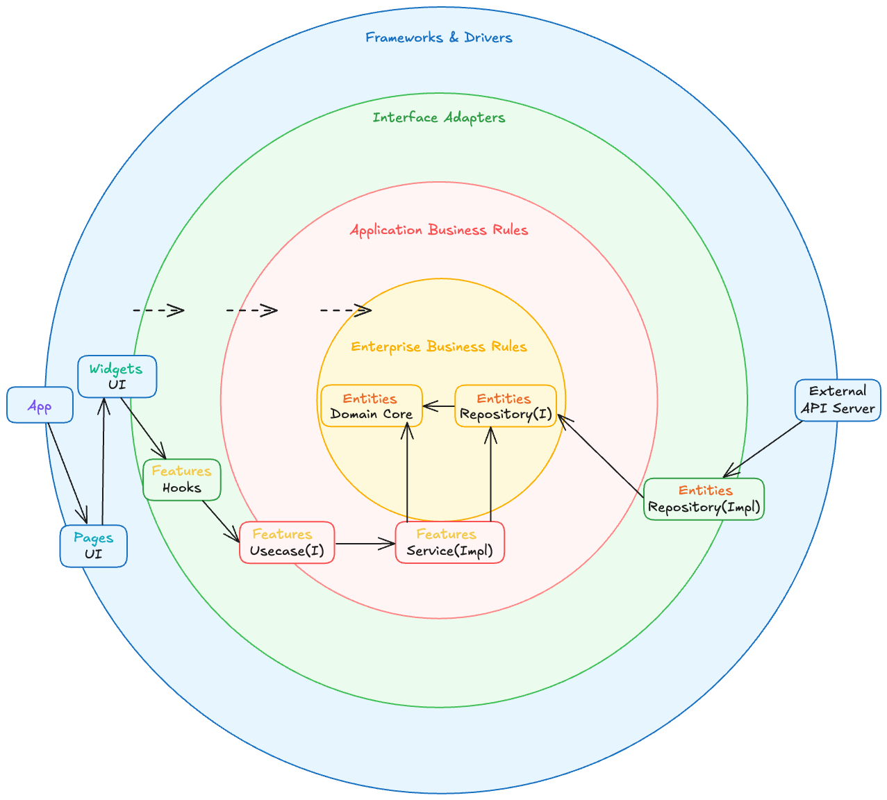

# Frontend Clean Architecture (with FSD & DDD)

_[한국어](README.ko.md)_

> ⚠️ Note: This project is an **educational example** of applying Clean Architecture, DDD patterns, and FSD to frontend development. It is designed for educational purposes and architectural understanding rather than production environments, with intentional structuring to clearly demonstrate each pattern and principle.

## Overview

This is sample code demonstrating how to combine three architectural patterns: Clean Architecture, Domain-Driven Design (DDD), and Feature-Sliced Design (FSD) in frontend development. The core concepts and practical application methods of each pattern have been specifically implemented in a Next.js environment.

> **Related Article**: [Frontend Clean Architecture (with FSD & DDD)](https://min71.dev/posts/fsd-ddd-clean-architecture)

### Core Concepts

- **FSD (Feature-Sliced Design)**: A methodology for systematically structuring frontend applications
- **DDD (Domain-Driven Design)**: A design approach centered on business domains
- **Clean Architecture**: Principles of dependency inversion and layer separation

## Folder Structure

```
src/
├── shared/       # Common utilities, API clients, domain base classes
├── entities/     # Business entities (User, Post, Comment)
├── features/     # Application business logic
├── widgets/      # Independent UI blocks
├── pages/        # Page components
└── app/          # App-wide configurations
```

### Entity Internal Structure Example

```
entities/post/
├── core/                   # Domain logic
│   ├── post.domain.ts      # Entity (business rules)
│   ├── post.factory.ts     # Factory (object creation)
│   └── post.repository.ts  # Repository Interface
├── infrastructure/         # External implementations
│   ├── api/                # API adapters
│   └── repository/         # Repository implementations
├── mapper/                 # Data transformations
├── types/                  # Type definitions
├── value-objects/          # ValueObject definitions
└── index.ts                # Public API
```

## Architecture Mapping



| Clean Architecture Layer       | FSD Implementation                                |
| ------------------------------ | ------------------------------------------------- |
| **Enterprise Business Rules**  | `entities/*/core/`                                |
| **Application Business Rules** | `features/*/services/`                            |
| **Interface Adapters**         | `features/*/hooks/`, `entities/*/infrastructure/` |
| **Frameworks & Drivers**       | `app/`, `pages/`, `widgets/`, External APIs       |

## Application Guide

This architecture is worth considering in the following situations:

- Projects requiring complex state management and business logic
- Projects that need continuous feature expansion over a long period
- Medium to large teams with multiple developers working together
- Agile environments where plans and requirements frequently change
- Services where code quality and test coverage are important

## Learning Resources

- [Feature-Sliced Design Official Documentation](https://feature-sliced.design/)
- [Domain-Driven Design](https://martinfowler.com/bliki/DomainDrivenDesign.html)
- [Clean Architecture](https://blog.cleancoder.com/uncle-bob/2012/08/13/the-clean-architecture.html)

---

The purpose of this project is not to demonstrate perfect implementation. The real value lies in understanding the characteristics of each pattern and developing the sense to determine when and how to apply them in actual development.
